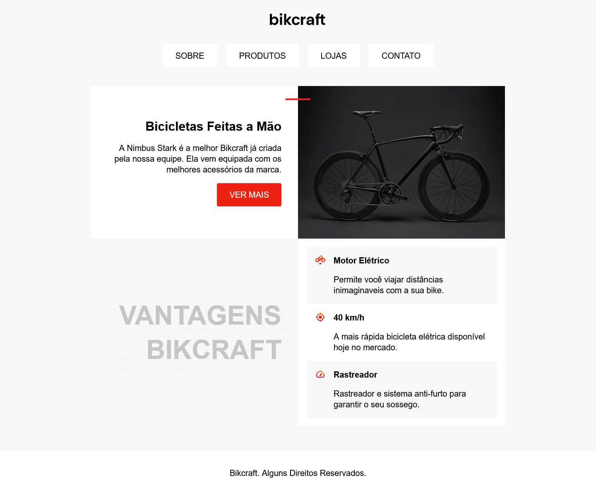

# ORIGAMID - Projeto Bikcraft

Hello 👋

Esse projeto faz parte das aulas do curso da ORIGAMID
O projeto vai ser desenvolvido conforme o desenrolar das aulas, ou seja, vai ser constantemente atualizado.

## Table of contents

- [Screenshot](#screenshot)
- [Links](#links)
- [Built with](#built-with)
- [Useful resources](#useful-resources)
- [Author](#author)

### Screenshot

<!--  -->

### Links

[Live Site](https://mateus-lr.github.io/Bikcraft/)

### Built with

- Semantic HTML5 markup
- CSS custom properties
- Responsive CSS
- Flexbox
- Grid Display
- :hover selector
- media queries

### Useful resources

- [:hover Selector](https://www.w3schools.com/cssref/sel_hover.asp)
- [Media Queries](https://developer.mozilla.org/pt-BR/docs/Web/CSS/Media_Queries/Using_media_queries)

## Author

- Website - [Mateus Rocha](https://github.com/mateus-lr)
- ORIGAMID - [ORIGAMID](https://www.origamid.com/)
- Twitter - [@matscript](https://www.twitter.com/maatscript)
